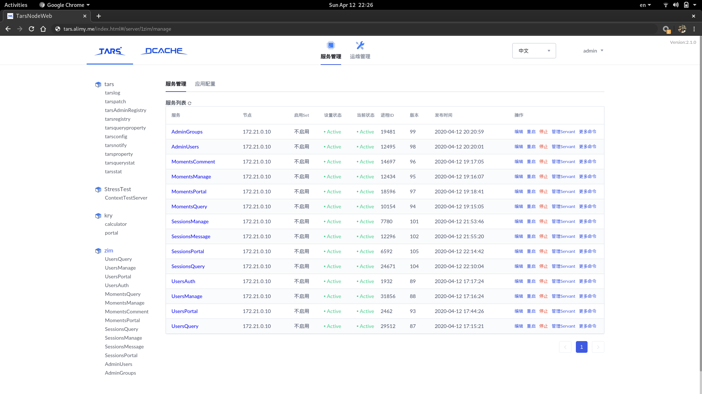

# zim-ms(zim 后端微服务）
[](https://sourcegraph.com/github.com/alimy/zim-ms)

基于[Tars](https://github.com/TarsCloud)和[go-mir](https://github.com/alimy/mir)开发微服务的简单代码组织结构，仅限学习参考用(不包括CI/CD)。

### 目录简介
```bash
% tree -L 3 .
├── app                          # 包含所有应用 
│   ├── admin                    # 包含内部运维管理相关的服务
│   │   ├── groups               # 群组运维相关服务
│   │   └── users                # 账号中心相关服务
│   ├── portal                   # 包含对外导出的服务(聚合服务，api网关对接的服务)
│   │   ├── moments              # 朋友圈相关的接口服务
│   │   ├── sessions             # 聊天会话相关的接口服务
│   │   └── users                # 用户关系(用户信息、群组信息、好友列表、群成员列表等)相关的接口服务
│   ├── service                  # 包含业务功能微服务(限内网访问)
│   │   ├── moments-comment      # 朋友圈条目评论(点评/点赞 等)
│   │   ├── moments-manage       # 朋友圈内容管理(添加/删除/访问控制 等）
│   │   ├── moments-query        # 朋友圈条目检索服务
│   │   ├── sessions-manage      # 聊天会话管理接口服务
│   │   ├── sessions-message     # 消息记录接口
│   │   ├── sessions-query       # 聊天会话检索接口服务
│   │   ├── users-auth           # 用户登录接口服务
│   │   ├── users-manage         # 用户关系管理接口服务
│   │   └── users-query          # 用户信息检索接口服务
│   └── tools                    # 辅助工具库
│      └── kry                   # 微服务模版代码生成工具
├── assets                       # 包含一些杂项资源
│   └── paw                      # paw api接口调试工具
├── build                        # 包含一些构建脚本
│   └── release                  # 包含tars部署用的发布包
│       ├── admin                # 内部管理相关服务的发布包
│       ├── portal               # 外部导出服务的发布包
│       └── service              # 内部业务功能微服务的发布包
└── library                      # 公共辅助lib库

```

### 使用指南
* 部署一套Tars,可以参考[这里](https://github.com/TarsCloud/TarsDocker)；

* 预备辅助工具
```bash
% git clone https://github.com/alimy/zim-ms
% cd zim-ms
% go get github.com/TarsCloud/TarsGo/tars/tools/tars2go@latest  # 获取tars2go
% cd app/tools/kry && make && cp kry $(GOPATH)/bin/ && cd -     # 安装辅助工具kry
```

* 创建内部微服务
```bash
% cd app/service # 所有内部业务的微服务都在这个目录创建，使用如下命令创建模版代码
% kry new -d users-query -s tars -p gitbus.com/exlab/zim-ss/app/service/users-query -n zim -c service -t UsersQuery
```

* 创建对外导出服务(汇聚服务，对接api网关)
```bash
% cd app/portal # 所有外部导出的服务接口都在这个目录创建，使用如下命令创建模版代码
% kry new -d users -s tars -s mir -p gitbus.com/exlab/zim-ss/app/portal/users -n zim -c portal -t UsersPortal
```

* 创建内部管理服务
```bash
% cd app/admin # 所有内部运维管理相关的服务接口都在这个目录创建，使用如下命令创建模版代码
% kry new -d groups -s tars -s mir -p gitbus.com/exlab/zim-ss/app/admin/groups -n zim -c admin -t AdminGroups
```

* 微服务打包，比如app/service/users-query
```bash
% cd app/service/users-query
% make release # 运行命令后，将会在../../../build/release/service/users-query生成包文件UsersQuery.tgz
% # 将该服务文件包通过tars管理界面上传就可以进行发布了
```

* 使用tarsgo编写业务逻辑以及发布微服务，参考[这里](https://github.com/TarsCloud/TarsDocs/tree/master/dev/tarsgo);

### Tars微服务部署运维界面

